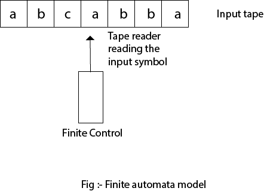
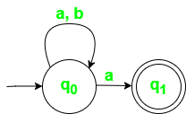
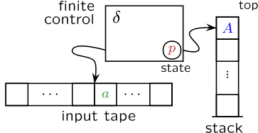

# Finite Automata

A finite automata (FA) is a simple idealized machine used to recognize patterns within input taken from some character set (or alphabet) Σ. The job of an FA is to accept or reject an input depending on whether the pattern defined by the FA occurs in the input.

A finite automata is a collection of 5 tuple:
- Q : The set of finite states
- Σ : The set of input alphabets
- 𝛿 : Transition function
- qo : Initial state
- F : Set of final states

## Model of Finite Automata
  
It is an abstract model of a digital computer which reads an input string and changes its internal state depending on the current input symbol.

### Finite Automata is characterized into two types:

#### Deterministic Finite Automata (DFA): 
DFA consists of 5 tuples {Q, Σ, q, F, δ}. 
- Q : set of all states.
- Σ : set of input symbols. ( Symbols which machine takes as input )
- qo : Initial state. ( Starting state of a - machine )
- F : set of final state.
- δ : Transition Function, defined as δ : Q X Σ --> Q.

In a DFA, for a particular input character, the machine goes to one state only. A transition function is defined on every state for every input symbol. Also in DFA null (or ε) move is not allowed, i.e., DFA cannot change state without any input character. 

For example, construct a DFA which accept a language of all strings ending with ‘a’.
Given:  Σ = {a,b}, q = {q0}, F={q1}, Q = {q0, q1}

<table border="1"><thead><tr><th>⇣State\Symbol⇢</th><th>a</th><th>b</th></tr></thead><tbody><tr><th>q0</th><td>q1</td><td>q0</td></tr><tr><th>q1</th><td>q1</td><td>q0</td></tr></tbody></table>

### Non Deterministic Finite Automata (NFA):
NFA is similar to DFA except following additional features: 

- Null (or ε) move is allowed i.e., it can move forward without reading symbols. 
- Ability to transmit to any number of states for a particular input. 

For example, construct a NFA which accept a language of all strings ending with ‘a’.
Given:  Σ = {a,b}, q = {q0}, F={q1}, Q = {q0, q1}

<table border="1"><thead><tr><th>⇣State\Symbol⇢</th><th>a</th><th>b</th></tr></thead><tbody><tr><th>q0</th><td>{q0,q1}</td><td>q0</td></tr><tr><th>q1</th><td>∅</td><td>∅</td></tr></tbody></table>

# Pushdown Automata (PDA):
Pushdown automata are nondeterministic finite state machines augmented with additional memory in the form of a stack, which is why the term “pushdown” is used, as elements are pushed down onto the stack. Pushdown automata are computational models—theoretical computer-like machines—that can do more than a finite state machine, but less than a Turing machine.

